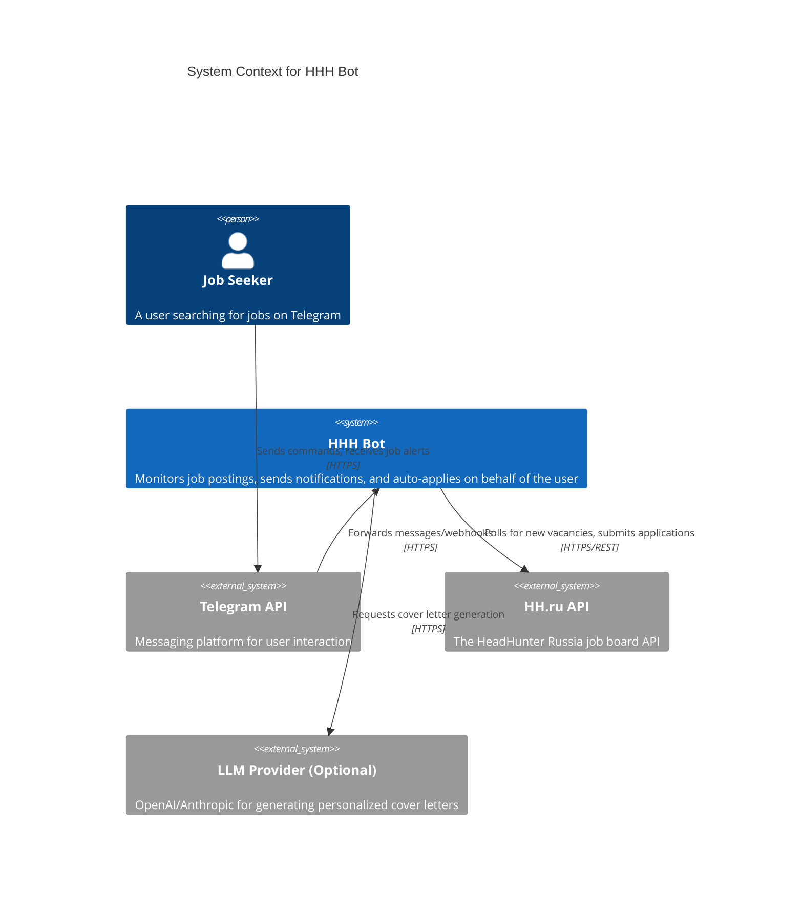

# Level 1: System Context (Global Schema)

This is the "bird's-eye view" of the entire system. It shows the users and the external systems the HHH Bot interacts with.

## Description
*   **Job Seeker**: Interacts exclusively through the Telegram UI.
*   **Telegram API**: Acts as the frontend presentation layer.
*   **HHH Bot**: The core system we are building. It orchestrates the entire flow.
*   **HH.ru API**: The source of truth for job vacancies.
*   **LLM Provider**: (Future) Used to generate smart, contextual responses based on the vacancy description.