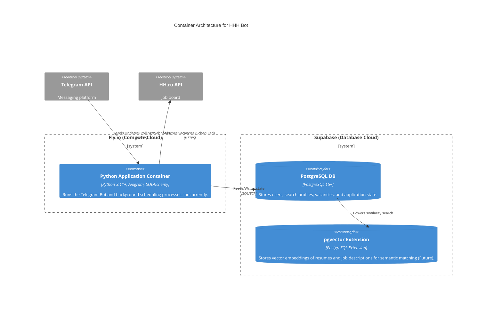

# Level 2: Container Architecture (Deployment Schema)

This level zooms into the "HHH Bot" system from Level 1 to show the deployable units (containers, databases) and how they communicate.

## Deployment Notes
*   **Single Container Strategy**: To keep costs at $0, the Telegram Bot (Aiogram) and the Job Scanner (APScheduler) run in the same Python process inside a single Docker container deployed to **Fly.io**.
*   **Database**: Hosted on **Supabase**. The application uses an async SQLAlchemy connection pool to talk to Postgres.
*   **AI Readiness**: Supabase provides `pgvector` out of the box, allowing us to easily transition from keyword-based matching to AI semantic matching later.