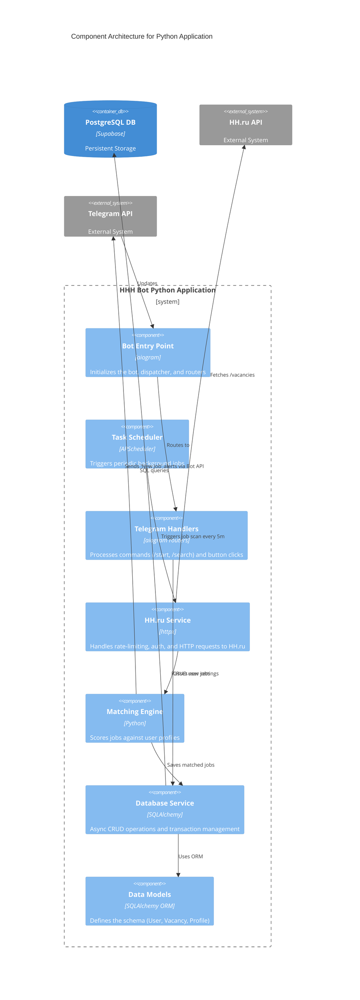

# Level 3: Component Architecture (Application Schema)

This level zooms into the "Python Application Container" from Level 2 to show the internal modules, services, and how data flows through the Python code.

## Execution Flows

### 1. The Bot Flow (User Interaction)
1. User sends `/search` in Telegram.
2. `bot_entry` receives the update and routes it to `handlers`.
3. `handlers` queries `db_service` for the user's active search profiles.
4. `handlers` formats a message and sends it back to Telegram.

### 2. The Background Job Flow (Monitoring)
1. `scheduler` wakes up every 5 minutes.
2. It asks `db_service` for all active search profiles across all users.
3. For each profile, it calls `hh_service` to fetch new vacancies.
4. The results are passed to the `match_service` to deduplicate and score against the user's criteria.
5. If a match is found, `db_service` saves the `Vacancy` and creates a `MonitoredJob` link.
6. The `match_service` triggers a Telegram notification to the user.