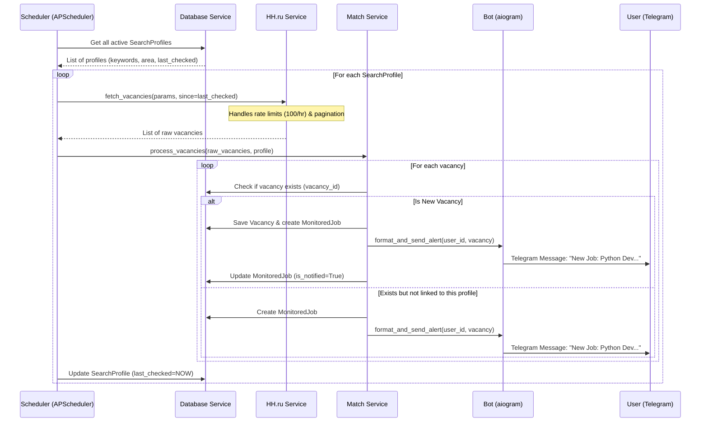

# Level 4: Feature Drill-Down - HH Scanner to Telegram

This document details the specific flow for the first core feature: **Scanning HH.ru for new vacancies and sending them to the user via Telegram.**

This fits perfectly into our Level 3 Component Architecture, specifically the interaction between the `Task Scheduler`, `HH.ru Service`, `Database Service`, and `Telegram Handlers`.

## 1. Sequence Diagram: The Scanning Flow

## 2. Component Implementation Details

### A. The HH.ru Service (`src/services/hh_monitor.py`)
**Responsibilities:**
*   Make HTTP GET requests to `https://api.hh.ru/vacancies`.
*   Handle pagination (fetching multiple pages if there are many results).
*   **Crucial:** Respect rate limits (100 requests per hour without auth).
*   Parse the JSON response into raw dictionaries.

### B. The Match/Processing Service (`src/services/app_tracker.py` or new `match_service.py`)
**Responsibilities:**
*   Take raw HH.ru data and convert it into SQLAlchemy `Vacancy` objects.
*   Check the database to prevent duplicate entries.
*   Create the `MonitoredJob` link between the `SearchProfile` and the `Vacancy`.

### C. The Bot Broadcaster
**Responsibilities:**
*   Format the `Vacancy` data into a readable Telegram message (using HTML or MarkdownV2).
*   Send the message to the specific `user_id` associated with the `SearchProfile`.
*   Include Inline Keyboard buttons (e.g., "Apply", "Ignore", "View on HH.ru").

### D. The Scheduler (`src/core/scheduler.py`)
**Responsibilities:**
*   Use `APScheduler` (specifically `AsyncIOScheduler`).
*   Run the job every X minutes (e.g., 5 minutes, configurable per profile).
*   Ensure jobs don't overlap (if HH.ru is slow, don't start the next scan until the current one finishes).

## 3. Implementation Plan (Our Approach)

To build this feature, we will execute the following steps in order:

1.  **Build HH.ru Client:** Implement `HHService` with basic `httpx` async calls.
2.  **Build Formatting Logic:** Create the function that turns a raw vacancy dict into a Telegram message string.
3.  **Build the Processing Loop:** Write the logic that fetches, checks the DB, saves, and sends the message.
4.  **Wire up the Scheduler:** Tie the processing loop to `APScheduler`.
5.  **Initialize Bot:** Set up the basic `aiogram` bot instance so the scheduler has an object to call `bot.send_message()` on.
