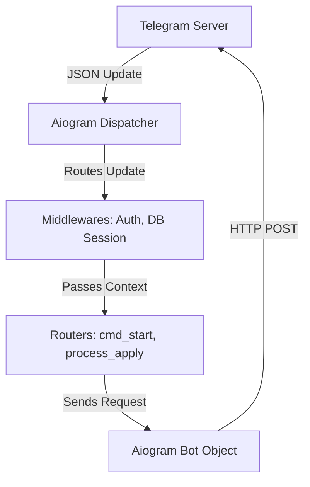

# Level 4: Feature Drill-Down - The Aiogram Framework

## What is `aiogram`?
`aiogram` is a modern and fully asynchronous framework for Telegram Bot API written in Python. It is currently the industry standard for building robust, scalable Telegram bots in Python, having largely replaced older synchronous frameworks like `pyTelegramBotAPI` (telebot).

## Why are we using it in HHH Bot?
1. **Fully Asynchronous (`asyncio`):** Because our bot needs to handle potentially hundreds of requests at once (fetching jobs from HH.ru, saving to the database, sending messages), we cannot afford for the program to "block" or freeze while waiting for an HTTP response. `aiogram` is built on top of `aiohttp`, meaning it handles thousands of concurrent updates seamlessly.
2. **Type Hinting & Pydantic:** It deeply integrates with Python type hints and Pydantic (which we use for configuration), making the code cleaner and less prone to bugs.
3. **Routers & Middlewares:** It introduces a modern routing system (similar to FastAPI or Flask blueprints), allowing us to split our bot handlers into separate files (e.g., `callbacks.py`, `commands.py`) rather than keeping everything in one giant `main.py`.
4. **FSM (Finite State Machine):** It has built-in support for conversational states (e.g., asking the user a sequence of questions to build a search profile).

## How it works in our Architecture

### Key Concepts we use:
- **`Bot` object:** Handles the outgoing communication (`bot.send_message()`).
- **`Dispatcher` object:** The engine that receives incoming updates (messages, button clicks) and decides which function should handle them.
- **`Router`:** We use `router = Router()` in `callbacks.py` to organize our handlers. The dispatcher imports these routers.
- **`F` (Magic Filter):** Aiogram's powerful filtering system. Example: `@router.callback_query(F.data.startswith("apply_"))` means "only trigger this function if the button clicked has data starting with 'apply_'".
